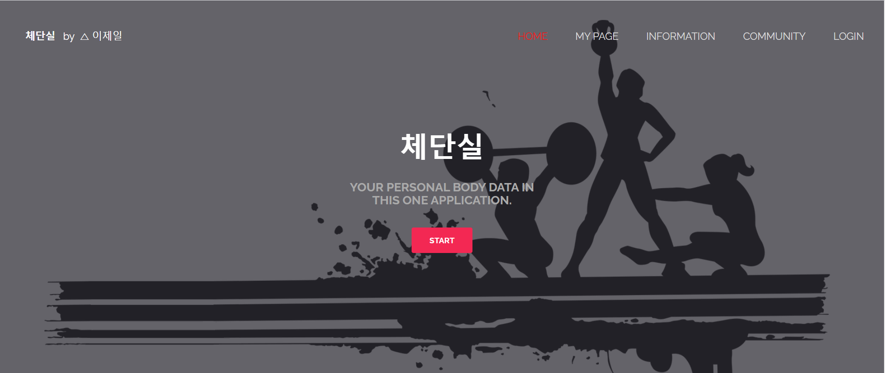
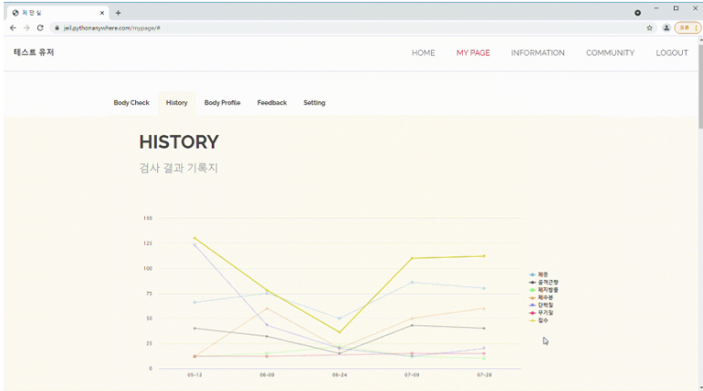
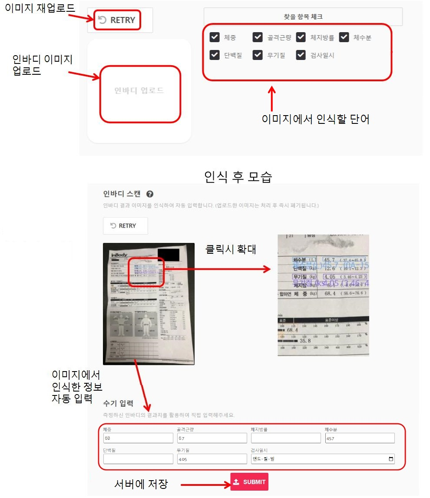
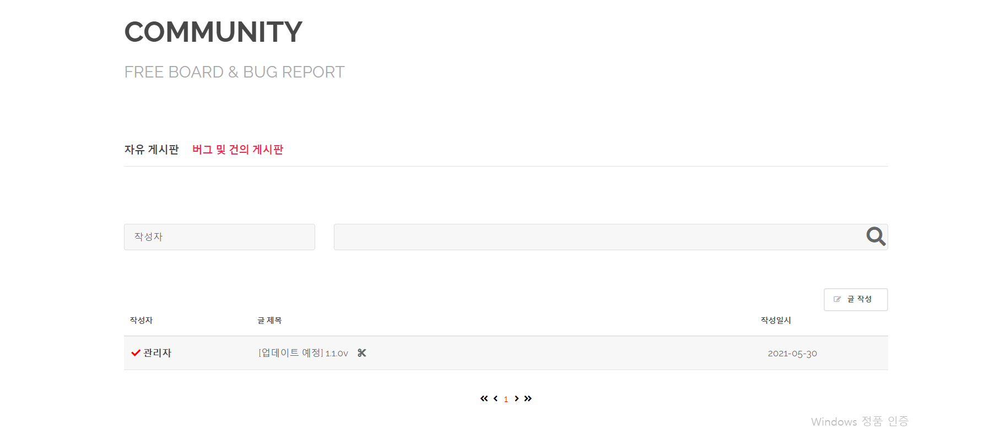
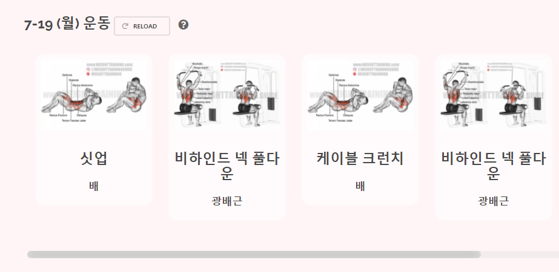

# 🤔 Who am I?
> ㅁㄴ
> ㅁㄴㅇ
> ㅁㄴㅇ

🕹 깃허브 : [WorldOneTop](https://github.com/WorldOneTop)

🖊 기술 블로그 : [Velog](https://velog.io/@dlwpdlf147)

✉ 이메일 : dlwpdlf147@naver.com
<!-- ## 🏆 수상 경력

- 18년도 서공제 5등 수상 
- 19년도 제일이가 제일이지 팀 창단 
- 20년도 특급전사 달성
- 21년도 육군 병장 만기 전역
- 22년도 
 -->
## 📖 Stack

- 📕 Language : Java, Kotlin, Python, C, Dart,  HTML, CSS, Java Script
- 📗 Back-End : Django, Node.js, MySQL
- 📘 Application : Android, Flutter

## 📌 Projects :
- 체단실 ( Web )

- 부실톡 ( Android )
- 대학생키우기 ( Android )
- 한림감사운동 ( Android )
- 혼밥여지도 ( Flutter )
- 서울스포츠 (mobile web)

대학생키우기1.png
부실톡1.PNG
부실톡2.PNG
부실톡3.PNG
부실톡4.PNG
서울스포츠1.PNG
서울스포츠2.PNG
서울스포츠3.PNG
서울스포츠4.PNG
서울스포츠5.PNG
서울스포츠6.PNG
체단실0.png
체단실1.PNG
체단실2.jpeg
체단실3.png
체단실4.png
