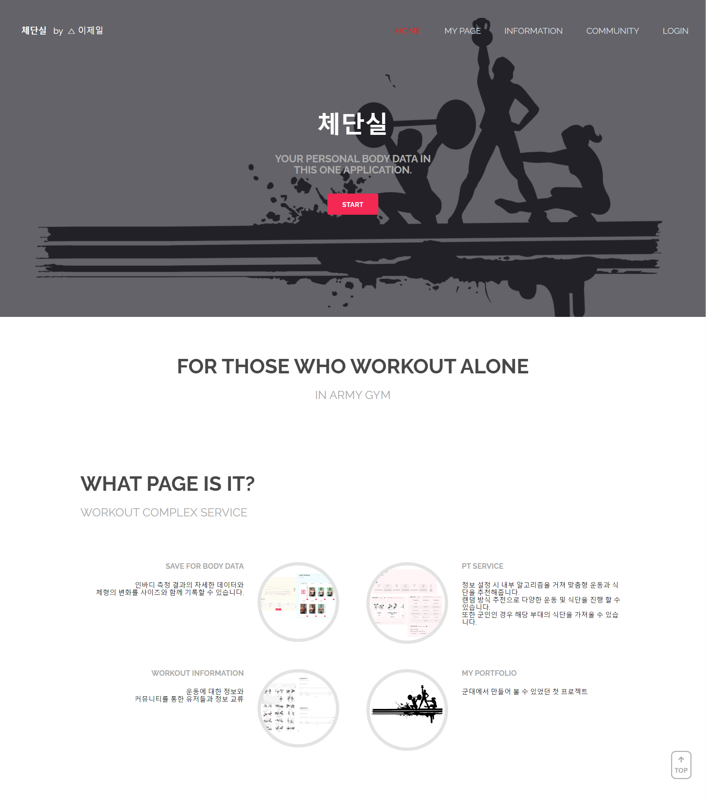
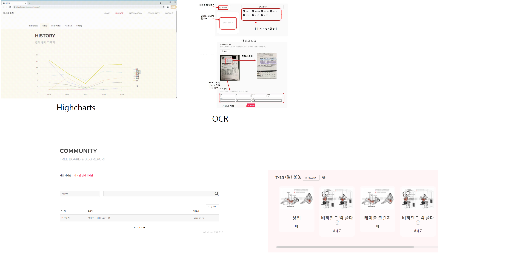

# 📄 이력서
> 
> - 이름 : 이제일
> - 소속 : 한림대학교 소프트웨어융합대학 빅데이터 전공 (부전공 : 컨텐츠 IT)
> - 희망 분야 : Android Developer, Back-End Engineer
> 
> 😺 깃허브 : [WorldOneTop](https://github.com/WorldOneTop)
> 
> 🖊 기술 블로그 : [Velog](https://velog.io/@dlwpdlf147)
> 
> ✉ 이메일 : dlwpdlf147@naver.com
<!-- ## 🏆 수상 경력

- 18년도 서공제 5등 수상 
- 19년도 제일이가 제일이지 팀 창단 
- 20년도 특급전사 달성
- 21년도 육군 병장 만기 전역
- 22년도 
 -->
## 📖 Stack

- 📕 Language : Java, Kotlin, Python, C, Dart,  HTML, CSS, Java Script
- 📗 Back-End : Django, Node.js, MySQL
- 📘 Application : Android, Flutter

## 📌 Projects :
### 🙏 한림감사운동 ( Android )
- 목적 : 감사운동을 원활히 진행할 수 있도록 UX기반의 어플 제작
- 개발 스택 : Android Studio, Django, Firebase Cloud Messaging, Oracle DB

 

### 혼밥여지도 ( Flutter )
- 목적 : 
- 개발 스택 : 

 

### 체단실 ( Web )
- 목적 : 
- 개발 스택 : 

 

### 부실톡 ( Android )
- 목적 : 
- 개발 스택 : 

 

### 대학생키우기 ( Android )
- 목적 : 
- 개발 스택 : 

### 서울스포츠 (mobile web)
- 목적 : 
- 개발 스택 :

 
 
### shadow gun ( Android )
- 목적 : 
- 개발 스택 : 

 

