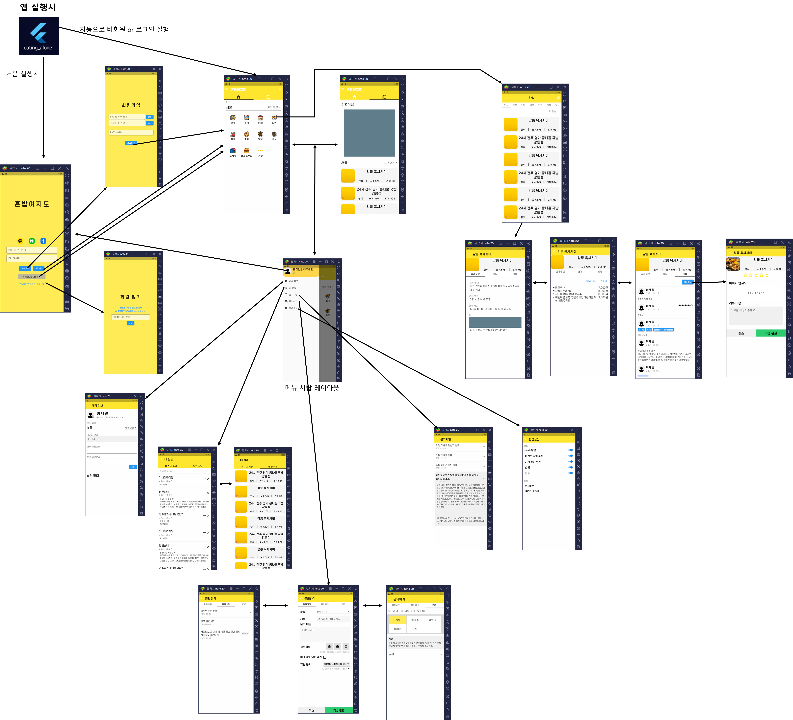

# 📄 이력서
> 
> - 이름 : 이제일
> - 소속 : 한림대학교 소프트웨어융합대학 빅데이터 전공 (부전공 : 컨텐츠 IT)
> - 희망 분야 : Android Developer, Back-End Engineer
> 
> 😺 깃허브 : [WorldOneTop](https://github.com/WorldOneTop)
> 
> 🖊 기술 블로그 : [Velog](https://velog.io/@dlwpdlf147)
> 
> ✉ 이메일 : dlwpdlf147@naver.com
<!-- ## 🏆 수상 경력

- 18년도 서공제 5등 수상 
- 19년도 제일이가 제일이지 팀 창단 
- 20년도 특급전사 달성
- 21년도 육군 병장 만기 전역
- 22년도 
 -->
## 📖 Stack

- 📕 Language : Java, Kotlin, Python, C, Dart,  HTML, CSS, Java Script, PHP
- 📗 Back-End : Django, Node.js, MySQL, Firebase
- 📘 Application : Android, Flutter

## 📌 Projects :
### 🙏 한림감사운동 ( Android )
- 목적 : 감사운동을 원활히 진행할 수 있도록 UX기반의 어플 제작
- 개발 스택 : Android, Django, Firebase Cloud Messaging, Oracle DB, MySQL

 

### 🍔 혼밥여지도 ( Flutter )
- 목적 : 혼자 밥먹는 사람들을 위해서 오픈소스와 같은 개념으로 모든 사용자가 편집 가능한 식당 정보 제공 어플
- 개발 스택 : Flutter, Django, Firebase SMS authentication, Kakao MAP API, MySQL

 

### 🏋 체단실 ( Web )
- 목적 : 군대 혹은 사회에서 운동하는 사람들을 위한 페이지로 운동 검색 및 커뮤니티 제공, 식단 및 운동 추천과 인바디 결과 및 몸의 변화 사진 저장 기능 제공
- 개발 스택 : Django, pythonanywhere, Kakao Vision OCR API, pil, opencv, hightchart

 

### 📱 부실톡 ( Android )
- 목적 : 소켓 통신을 이용한 채팅(1:1, 단체) 기능 구현, 텍스트와 이미지 및 위치 정보 전송
- 개발 스택 : Android, Node.js, Google MAP API, SQLite

 

### 👨‍🎓 대학생키우기 ( Android )
- 목적 : 소프트웨어 전시회용으로 만든 여러 조작을 통해 대학생 캐릭터를 키우는 게임
- 개발 스택 : Android

### 🏞 서울스포츠 (mobile web)
- 목적 : 서울시 공공 데이터 활용 공모전에 참가용으로 서울의 공원 데이터를 이용해 커뮤니티 및 공원 정보 제공
- 개발 스택 : Android, Bitnami, Bootstrap, PHP

 
 
### 🔫 shadow gun ( Android )
- 목적 : 공대 학술제인 서공제에 출시된 작품으로 무기(총)를 가지고 서로를 맵에 떨어뜨리거나 체력을 모두 닳게하여 경쟁하는 방식의 게임
- 개발 스택 : Android

 

